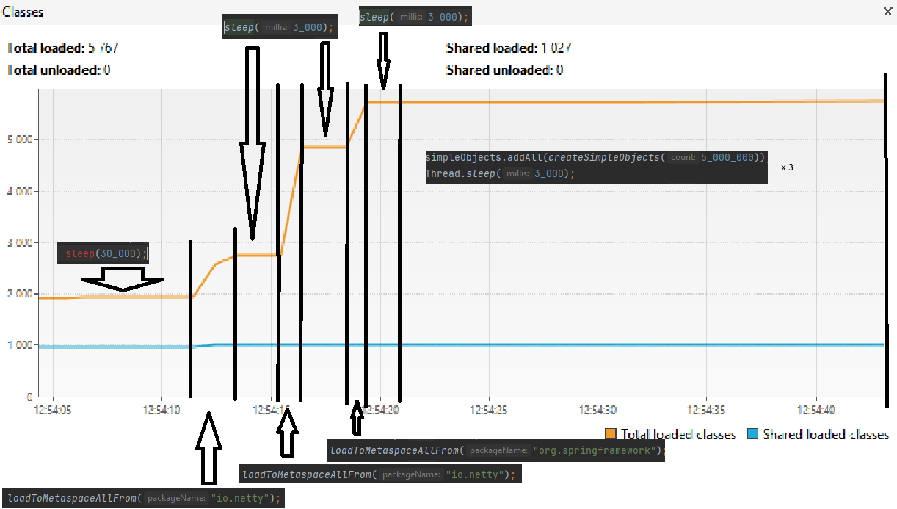
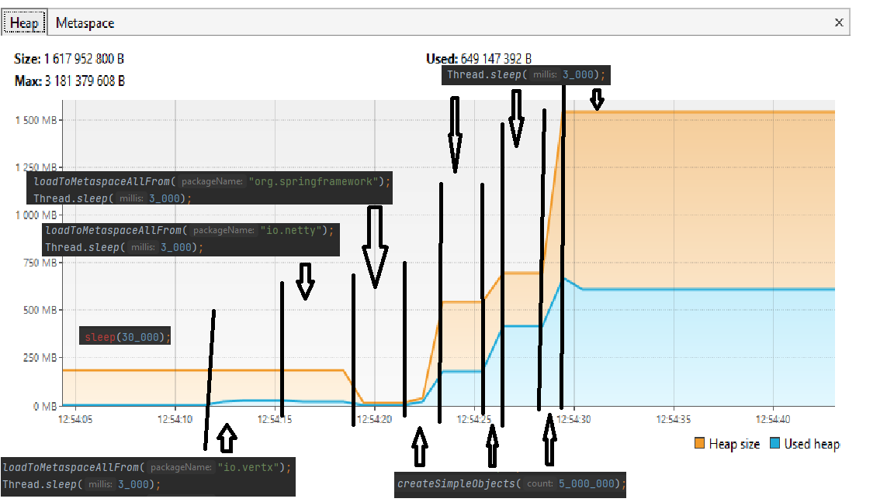
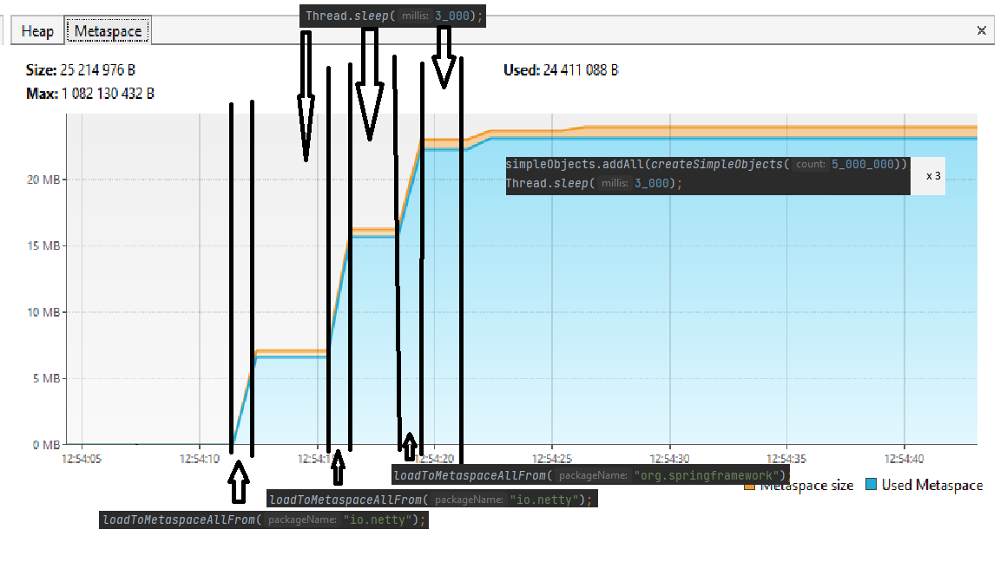

<h2>1 задание: Понимание JVM</h2>

1. Загрузка классов (classLoader)

а) Bootstrap ClassLoader - загрузка всех классов, принадлежащих ядру java (что именно за классы? я не увидел и поэтому не могу пару примеров указать)

б) Platform ClassLoader - загрузка всех классов java.util (коллекции, дата, рандом, исключения)

в) Application ClassLoader - загрузка класса JvmComprehension

2. Metaspace содержит в себе JvmComprehension.class и systems classses

3. Область памяти и сборщик мусора 

В стэке создаются фрейм "main". Во фрейме main создаются переменные i, o, ii: o и ii содержат в себе ссылки на объекты, а сами объекты хранятся в куче(хипе)

при обращении к методу printAll - создается его фрейм в стеке
создаются передаваемые переменные внутри фрейма printAll : o, i, ii, где i - хранит в себе значение, а o и ii - ссылки на уже существующие объекты.
создается ссылочная переменная uselessVar.
System.out.println(o.toString() + i + ii):
создается новый фрейм System.out.println с передачей параметра i и ссылок
После уничтожается фрейм System.out.println и все, что он содержит.
После выполнения метода printAll происходит возврат в метод main, а стек printAll уничтожается вместе с переменными.
Объект, на который ссылалась переменная uselessVar, будет уничтожена сборщиком мусора, так как больше никто не ссылается на этот объект.

Возвращаемся во фрейм main
и аналогично создается новый фрейм System.out.println с параметром "finished".
после уничтожается фрейм main и сборщиком мусора уничтожаются "все" объекты, так как главный метод закончил свою работу.

<h2>2 задание: Исследование JVM через VisualVM</h2>

В первую очередь выполняется сон главного потока на 30 секунд, после выполняется запуск метода "loadToMetaspaceAllFrom("io.vertx");". который загружает из файла 529 классов.
Далее сон на 3 секунды, запуск "loadToMetaspaceAllFrom("io.netty")" и загрузка ещё 2117 классов.
После снова сон 3 секунды, запуск "loadToMetaspaceAllFrom("org.springframework")" и загрузка ещё 869 классов, плс сон 3 секунды.
Выполняется создание 5_000_000 объектов, сохранение в лист и сон на 3 секунды, и так 3 раза. На скринах видно, в каких местах какие выполняются методы.

